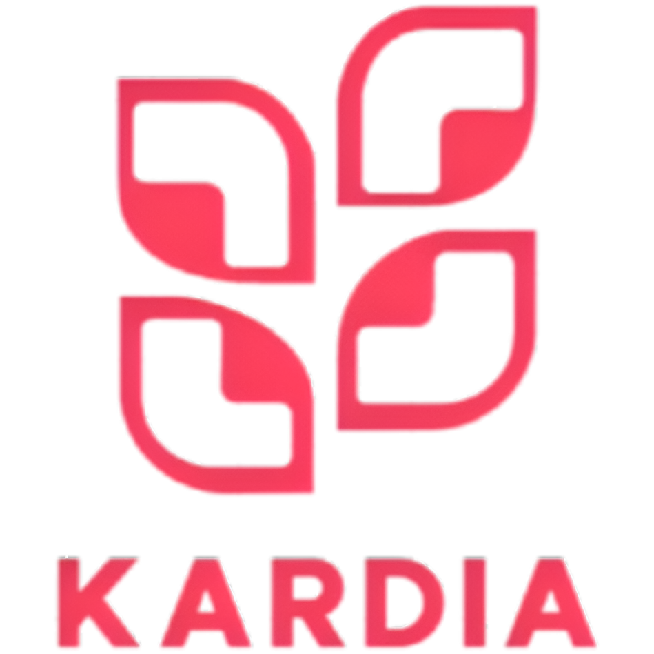

  

<h1 align="center">Selamat Datang di Komunitas Kardia! 👋</h1>

  <strong>Revolusi Skrining Jantung Berbasis SCORE2 dan AI yang Cepat, Mudah, dan Terpercaya</strong>
   
   
  
  
  

---

### **Tentang Kardia**

**Kardia** adalah aplikasi web untuk deteksi dini risiko penyakit jantung pengguna dalam 10 tahun ke depan menggunakan metode klinis [SCORE2](https://academic.oup.com/eurheartj/article/45/Supplement_1/ehae666.2696/7835147) dan variannya, berdasarkan data yang diisi melalui kuesioner.

---

### 📋 Daftar Isi

1.  [Fitur Unggulan](#-fitur-unggulan)
2.  [Tumpukan Teknologi](#-tumpukan-teknologi)
3.  [Alur Penggunaan](#️-alur-penggunaan-cara-kerja)
4.  [Tim Inti Komunitas](#-tim-inti-komunitas)
5.  [Tanya Jawab (FAQ)](#-tanya-jawab-faq)
6.  [Dampak & Kontribusi pada SDGs](#-dampak--kontribusi-pada-sdgs)
7.  [Repositori Utama](#-repositori-utama)

---

### ✨ Fitur Unggulan

| Fitur                                 | Deskripsi                                                                                                                                                                                                                                   |
| :------------------------------------ | :------------------------------------------------------------------------------------------------------------------------------------------------------------------------------------------------------------------------------------------ |
| 🔬 **Skrining Berbasis Klinis**       | Sistem AI menganalisis data Anda untuk memberikan estimasi risiko kardiovaskular 10 tahun ke depan, berdasarkan model klinis terverifikasi yaitu [SCORE2](https://academic.oup.com/eurheartj/article/45/Supplement_1/ehae666.2696/7835147). |
| 🤖 **Interpretasi Cerdas Gemini API** | Hasil skor yang kompleks diterjemahkan oleh Gemini API menjadi narasi yang personal, motivasional, dan mudah Anda pahami.                                                                                                                   |
| ❤️ **Rencana Aksi & Edukasi**         | Dapatkan rekomendasi jelas mengenai aksi medis dan perubahan gaya hidup, lengkap dengan konten edukasi yang relevan.                                                                                                                        |
| 📈 **Dasbor & Riwayat Progres**       | Pantau perjalanan kesehatan Anda melalui dasbor visual dan akses seluruh riwayat analisis untuk melihat tren dari waktu ke waktu.                                                                                                           |
| 💬 **Konsultasi Awal via Chat AI**    | Berinteraksilah dengan data kesehatan Anda sendiri melalui Chat AI kami sebagai sarana konsultasi awal yang aman.                                                                                                                           |

---

### 💻 Tumpukan Teknologi

Kardia dibangun menggunakan teknologi modern yang andal dan skalabel.

  
  
  
  
  

---

### ⚙️ Alur Penggunaan (Cara Kerja)

1.  **Registrasi & Buat Profil**
    Buat akun Anda dan lengkapi profil dasar Anda.

2.  **Isi Kuesioner Kesehatan**
    Jawab serangkaian pertanyaan terarah mengenai gaya hidup, riwayat kesehatan, dan data biometrik Anda.

3.  **Dapatkan Analisis Instan**
    AI akan memproses data Anda dan menyajikan dasbor hasil yang komprehensif, termasuk skor risiko Anda.

4.  **Jelajahi Hasil & Rekomendasi**
    Pahami faktor-faktor yang paling memengaruhi skor Anda dan pelajari rencana aksi yang disarankan oleh sistem.

5.  **Pantau & Konsultasi**
    Gunakan aplikasi secara berkala untuk melacak progres Anda dan ajukan pertanyaan kepada asisten AI jika Anda membutuhkan klarifikasi.

---

### 👨‍💻 Super Team 

Kardia digerakkan oleh semangat kolaborasi dari para kontributor inti kami.

| Nama              | Peran   | GitHub Profile                                                                                                 |
| ----------------- | ------- | -------------------------------------------------------------------------------------------------------------- |
| Muhana Naufal     | Hustler |  [muhananaufal](https://github.com/muhananaufal) |
| Berliana Kharisma | Hipster |  [brlianaln](https://github.com/brlianaln)          |
| Nasywan Damar     | Hacker  |  [MastayY](https://github.com/MastayY)                |

---

### 🧠 Tanya Jawab (FAQ)

**Q: Apakah Kardia menggantikan peran dokter?**
**A:** **Sama sekali tidak.** Kardia adalah alat bantu informasi dan skrining dini. Aplikasi ini dirancang untuk mendukung, bukan menggantikan, konsultasi dan diagnosis dari tenaga medis profesional.

**Q: Seberapa akurat analisis AI-nya?**
**A:** Analisis kami didasarkan pada model klinis [SCORE2](https://academic.oup.com/eurheartj/article/45/Supplement_1/ehae666.2696/7835147) yang telah divalidasi secara ilmiah untuk estimasi risiko 10 tahun ke depan.

**Q: Bagaimana keamanan data saya dijamin?**
**A:** Keamanan dan privasi Anda adalah prioritas utama kami. Semua data sensitif dienkripsi baik saat transit maupun saat disimpan, dan kami menerapkan praktik terbaik untuk melindungi akun Anda.

---

### ✨ Dampak & Kontribusi pada SDGs

Kami percaya bahwa teknologi harus diciptakan untuk kebaikan. Proyek Kardia secara langsung dirancang untuk mendukung dan berkontribusi pada pencapaian beberapa Tujuan Pembangunan Berkelanjutan (SDGs) dari PBB.

- **❤️ SDG 3: Kehidupan Sehat dan Sejahtera**

  - Ini adalah **tujuan utama** kami. Kardia secara langsung menyediakan alat deteksi dini untuk penyakit jantung, yang merupakan salah satu penyakit tidak menular paling mematikan, serta mendorong manajemen kesehatan yang proaktif.

- **📚 SDG 4: Pendidikan Berkualitas**

  - Kardia berperan sebagai platform edukasi dengan **meningkatkan literasi kesehatan**. Kami menerjemahkan data medis yang rumit menjadi wawasan yang mudah dipahami, memberdayakan pengguna dengan pengetahuan untuk membuat keputusan yang lebih baik.

- **♀️ SDG 5: Kesetaraan Gender**

  - Penyakit jantung dapat bermanifestasi secara berbeda pada pria dan wanita. Kardia menggunakan model perhitungan yang **mempertimbangkan perbedaan gender**, sehingga memastikan analisis dan rekomendasi yang lebih adil dan akurat untuk semua.

- **💡 SDG 9: Industri, Inovasi, dan Infrastruktur**

  - Sebagai aplikasi berbasis AI, Kardia adalah bentuk nyata dari **inovasi teknologi di sektor kesehatan**. Kami membangun infrastruktur kesehatan digital yang modern untuk menjawab tantangan kesehatan di masa depan.

- **🤝 SDG 10: Mengurangi Ketimpangan**

  - Kardia **mendobrak batasan akses** terhadap layanan kesehatan. Dengan menyediakan alat skrining yang murah dan mudah diakses melalui ponsel, kami membantu mengurangi ketimpangan yang disebabkan oleh faktor biaya, geografis, dan waktu.

- **🏙️ SDG 11: Kota dan Permukiman Berkelanjutan**

  - Dengan mendorong kesehatan preventif, Kardia membantu menciptakan masyarakat yang lebih sehat dan produktif. Ini secara tidak langsung dapat **meringankan beban pada fasilitas kesehatan publik** di perkotaan, menjadikannya lebih efisien.

- **🌐 SDG 17: Kemitraan untuk Mencapai Tujuan**
  - Keberhasilan Kardia bergantung pada **kolaborasi lintas sektor**. Proyek ini secara alami mendorong kemitraan antara pengembang teknologi, ahli medis, akademisi, dan pemerintah untuk menciptakan dampak yang luas dan berkelanjutan.

---

### 📂 Repositori Utama

- **[kardia-frontend](https://github.com/kardia-health/kardia-frontend)**: Antarmuka aplikasi (React).
- **[kardia-backend-api](https://github.com/kardia-health/kardia-backend-api)**: API, logika, dan integrasi AI (Laravel).

---

### 📌 Catatan Akhir

> Ambil Langkah Bijak untuk Jantung Sehat dengan Kardia
>
> "Deteksi Dini, Jaga Jantung Setiap Hari"

© 2025 Kardia – Dibuat dengan ❤️ oleh Kardia Team
